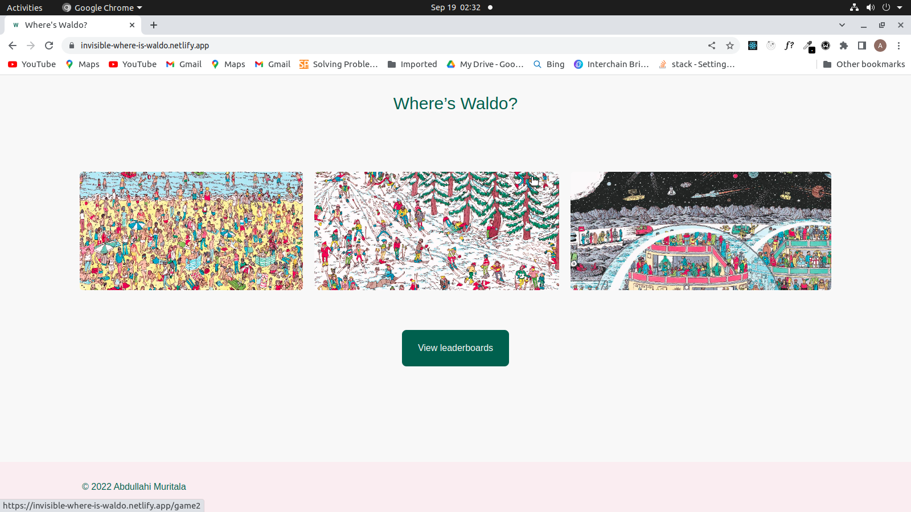

# Where is waldo

This is a solution to the [Where is waldo project](https://www.theodinproject.com/lessons/node-path-javascript-where-s-waldo-a-photo-tagging-app). The Odin Project help you improve your coding skills by building realistic projects.

## Table of contents

- [Overview](#overview)
  - [The project](#the-project)
  - [Screenshot](#screenshot)
  - [Links](#links)
- [Available Scripts](#available-scripts)
  - [Npm start](#npm-start)
  - [Npm test](#npm-test)
  - [Npm Run Build](#npm-run-build)
  - [Npm Run Eject](#npm-run-eject)
- [My process](#my-process)
  - [Designed with](#designed-with)
  - [Built with](#built-with)
  - [What I learned](#what-i-learned)
  - [Continued development](#continued-development)
  - [Useful resources](#useful-resources)
- [Author](#author)
- [Acknowledgments](#acknowledgments)

## Overview

### The project

Users should be able to:

- View the optimal layout for each of the website's pages depending on their device's screen size
- Select the particular picture they will like to compete with
- Play the game and record their names on the leaderboard
- View the names and best times on the leaderboard

### Screenshot

### Links

- Repo URL: https://github.com/invisibleopey/where-is-waldo.git
- Live Site URL: https://invisible-where-is-waldo.netlify.app/

## Available Scripts

In the project directory, you can run:

### `npm start`

Runs the app in the development mode.\
Open [http://localhost:3000](http://localhost:3000) to view it in the browser.

The page will reload if you make edits.\
You will also see any lint errors in the console.

### `npm test`

Launches the test runner in the interactive watch mode.\
See the section about [running tests](https://facebook.github.io/create-react-app/docs/running-tests) for more information.

### `npm run build`

Builds the app for production to the `build` folder.\
It correctly bundles React in production mode and optimizes the build for the best performance.

The build is minified and the filenames include the hashes.\
Your app is ready to be deployed!

See the section about [deployment](https://facebook.github.io/create-react-app/docs/deployment) for more information.

### `npm run eject`

**Note: this is a one-way operation. Once you `eject`, you can’t go back!**

## My process

### Designed with

- Wireframing and low fidelity design on Figma
- [Figma design available here](https://www.figma.com/file/SCZwaUyfUF99oov0bSyWrF/Where's-waldo?node-id=0%3A1)

### Built with

- Semantic HTML5 markup
- [Tailwind CSS](https://tailwindui.com/)
- Mobile-first workflow
- [React](https://reactjs.org/) - JS library
- [Typescript](https://www.typescriptlang.org/)
- [React router](https://reactrouter.com/en/main)
- Firebase BaaS
- [Netlify](https://www.netlify.com/)

### What I learned

I lean how to:

- use relative screen size to get the absolute coordinate of mouse event.
- properly type setTimeouts in TypeScript
- use continious deployment on [netlify](https://www.netlify.com/).
- type firestore documents properly

### Continued development

- I would love to revisit the project once I learn NodeJS to remove the coordinate checking logic from the frontend.

### Useful resources

- https://docs.netlify.com/
- https://reactrouter.com/en/main
- https://www.typescriptlang.org/docs/
- https://tailwindcss.com/docs/

## Author

- Abdullahi Muritala
- Twitter - [@invisibleopey](https://www.twitter.com/invisibleopey)
- LinkedIn - [abdullahimuritala](https://www.linkedin.com/in/abdullahimuritala/)
- Website - [abdullahimuritala]()

## Acknowledgments

I acknowledge the core team at the odin project for putting together the amazing curriculum. This has put order to the web development journey of self-taught software developers like myself.
